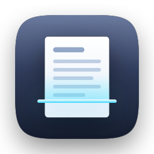
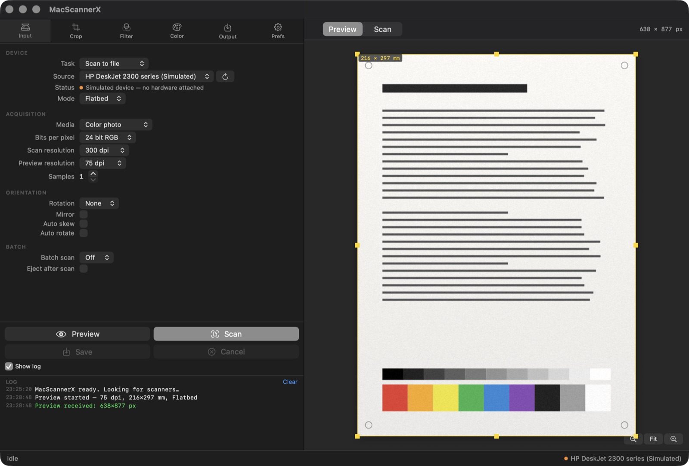
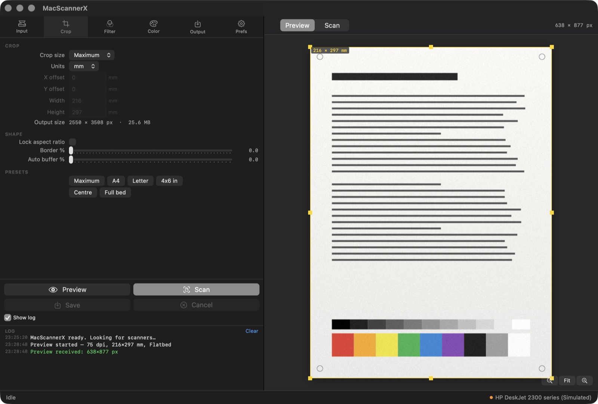
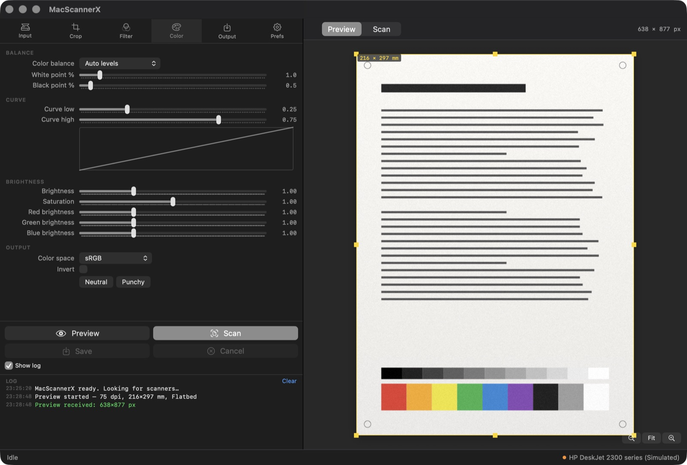

<div align="center">



# MacScannerX

**A free, open-source VueScan alternative for macOS.**

Native SwiftUI scanner app for USB, AirScan/eSCL and Image Capture scanners —
including HP DeskJet printers that macOS refuses to scan from at all.

[](https://github.com/HassanNiazi/MacScannerX/actions/workflows/ci.yml)
[](https://github.com/HassanNiazi/MacScannerX/releases/latest)
[](https://www.apple.com/macos/)
[](https://github.com/HassanNiazi/MacScannerX/releases/latest)
[](LICENSE)



</div>

---

## Download

**[⬇ Download MacScannerX.dmg](https://github.com/HassanNiazi/MacScannerX/releases/latest/download/MacScannerX.dmg)** — macOS 14 Sonoma or later, universal (Apple silicon and Intel).

> [!IMPORTANT]
> **macOS will refuse to open MacScannerX on first launch.** You will see
> *"MacScannerX.app" Not Opened — Apple could not verify it is free of
> malware.* This is expected. The app is not signed with an Apple Developer
> ID and not notarised, because that requires a paid Apple Developer Program
> membership (US$99/year) that this free project does not have. Nothing is
> wrong with the download — macOS shows the same dialog for every app that
> is not notarised. The steps below get you past it once; macOS remembers
> the choice.

1. Open the DMG and drag **MacScannerX** to **Applications**.
2. Double-click the app. macOS blocks it with the dialog above — click
   **Done**.
3. Open **System Settings → Privacy & Security**, scroll down to the
   *Security* section. You will see *"MacScannerX" was blocked to protect
   your Mac.* Click **Open Anyway**, then **Open Anyway** again in the
   confirmation, and authenticate.
4. The app opens. From now on it launches normally.

   Prefer the terminal? One command does the same thing by clearing the
   quarantine flag:

   ```bash
   xattr -dr com.apple.quarantine /Applications/MacScannerX.app
   ```

5. Optional — verify the download against the published checksum:

   ```bash
   shasum -a 256 -c MacScannerX.dmg.sha256
   ```

On macOS 14 Sonoma and earlier, right-click the app → **Open** → **Open**
also works and skips step 3.

If you want to check the download for yourself before trusting it: the
[source is public](https://github.com/HassanNiazi/MacScannerX), every release
is [built by GitHub Actions](https://github.com/HassanNiazi/MacScannerX/actions/workflows/release.yml)
from a tagged commit, and the checksum above matches what CI produced.

Every release is built and self-tested by CI before it is published; the DMG
carries a universal binary and a SHA-256 sidecar. Release notes and earlier
versions live on the
[releases page](https://github.com/HassanNiazi/MacScannerX/releases).

Prefer to build it yourself? See [Build from source](#build-from-source).

---

## Why MacScannerX

VueScan is excellent software and has supported thousands of scanners for
decades. It is also commercial, closed-source, and licensed per machine.
MacScannerX is the free alternative: it covers the modern paths — USB,
AirScan/eSCL over Wi-Fi, and anything Image Capture already understands — with
the full options panel you would expect, and the source in the open.

| | MacScannerX | VueScan |
|---|---|---|
| Price | Free | Paid licence, per machine |
| Source | Open (Apache-2.0) | Closed |
| Native macOS UI | SwiftUI, universal 2 | Cross-platform toolkit |
| AirScan / eSCL over Wi-Fi | ✅ | ✅ |
| Image Capture scanners | ✅ | ✅ |
| HP LEDM over USB (no HP software) | ✅ | ✅ |
| Searchable PDF (OCR) | ✅ Vision | ✅ |
| Multi-page PDF and TIFF | ✅ | ✅ |
| Tone curve, auto levels, descreen | ✅ | ✅ |
| Film and slide scanning, colour negatives | ❌ | ✅ |
| Legacy SCSI / FireWire / decades-old drivers | ❌ | ✅ |
| Windows and Linux | ❌ macOS only | ✅ |

Short version: if you scan documents and photos on a modern Mac, MacScannerX
does the job for nothing. If you scan 35 mm negatives or own a scanner from
2003, buy VueScan — it earns its price there.

*MacScannerX is an independent project and is not affiliated with, endorsed by,
or derived from Hamrick Software or VueScan.*

---

## Supported scanners

- **Any AirScan / eSCL scanner** — most network printers and scanners made
  since about 2015 (HP, Canon, Epson, Brother, Xerox…). Discovered over Bonjour;
  no vendor software, no drivers.
- **Any scanner macOS already sees** — anything with an Image Capture driver,
  over USB or shared from another Mac.
- **HP printers over USB with no driver at all** — driven directly over HP's
  LEDM protocol. This is what makes cheap HP all-in-ones scan on a Mac when
  *Printers & Scanners* insists they cannot.
- **No scanner at all** — a built-in simulated device renders a synthetic test
  page, so every control works before hardware arrives.

Tested against an **HP DeskJet 2300 series** over both USB and Wi-Fi.

---

## Features

Six tabs, and every control is wired to real work — nothing is decorative.

| Tab | Controls |
|---|---|
| **Input** | task, device, flatbed/feeder, media type, bit depth, scan & preview resolution, samples, rotation, mirror, auto-skew, auto-rotate, batch |
| **Crop** | Auto / Maximum / Manual / A4 / A5 / Letter / Legal / 4×6 / 5×7 / 8×10, X-Y offset, width, height, aspect lock, border %, auto-crop buffer, live output-size and file-size readout |
| **Filter** | restore colors, restore fading, descreen (by screen frequency), grain reduction, sharpen, line-art threshold |
| **Color** | colour balance (none/neutral/auto-levels/auto-white/landscape/manual), white & black point, tone curve with live graph, brightness, saturation, per-channel R/G/B gain, output colour space, invert |
| **Output** | folder, `scan+.jpg`-style auto-numbered names, JPEG / TIFF / PNG / PDF / OCR text, JPEG quality, TIFF compression, multi-page PDF, PDF paper size, searchable PDF, OCR language |
| **Prefs** | units, advanced options, settings file location, reset |

Plus a draggable crop rectangle with eight resize handles, a timestamped log
pane, and a progress bar that reports real backend stages.

<div align="center">


</div>

Settings persist to `~/Library/Application Support/MacScannerX/settings.json`.

---

## Build from source

No Xcode required — Command Line Tools and SwiftPM are enough.

```bash
git clone https://github.com/HassanNiazi/MacScannerX.git
cd MacScannerX
./build.sh release                    # → build/MacScannerX.app (host arch)
./build.sh release universal dmg      # → universal .app + build/MacScannerX.dmg
open build/MacScannerX.app
```

`universal` cross-compiles both slices by triple and merges them with `lipo`,
so it works on Command Line Tools alone — SwiftPM's `--arch` flag would need
full Xcode.

The binary ships a self-test that drives the whole non-interactive path —
simulated acquisition, the Core Image pipeline, every output format, and an
offscreen render of all six tabs:

```bash
build/MacScannerX.app/Contents/MacOS/MacScannerX --selftest /tmp/msx-check
```

```
  ok    acquisition          1275×1754 px at 150 dpi
  ok    pipeline crop+rotate 709×591 px
  ok    pipeline bilevel     2 distinct luminance levels
  ok    pipeline invert      mean 0.878 → 0.544
  ok    naming               scan0001 → scan0002, 20260817-page0001.tif
  ok    output               7 files, PDF 2 pages @ 297×419 pt
  ok    auto crop            found (50, 120, 200, 300)
  ok    eSCL XML             well-formed, 2550×3300 units, RGB24, Platen
  ok    eSCL caps            HP DeskJet 2300 series, 215.9×297.0 mm, 5 resolutions, flatbed only
  ok    UI render            ui-input.png, ui-crop.png, ui-filter.png, ui-color.png, ui-output.png, ui-prefs.png

PASS — all checks green
```

Two hardware diagnostics, which do touch the scanner:

```bash
# What each backend can see, plus a capability probe of the first real device.
build/MacScannerX.app/Contents/MacOS/MacScannerX --devices 8

# Acquire one real page, run the full pipeline, write it out.
build/MacScannerX.app/Contents/MacOS/MacScannerX --testscan 200 /tmp/page.jpg
```

How the backends and the image pipeline actually work is written up in
**[docs/ARCHITECTURE.md](docs/ARCHITECTURE.md)**.

---

## Troubleshooting

**The scanner does not appear.**

- Quit **HP Smart** and **HP Easy Scan** — they hold the USB interface open.
- Over Wi-Fi, allow MacScannerX under **System Settings → Privacy & Security →
  Local Network**.
- Press the refresh button next to the Source picker to re-browse, or run
  `--devices` for a per-backend report.

**Printers & Scanners lists my printer, so scanning should work — right?**

No. That entry is a CUPS *print* queue and proves nothing about scanning.
`system_profiler SPPrintersDataType` reports the truth under `Scanning
support:`. On a DeskJet 2300 it says `No` — MacScannerX scans from it anyway,
over HP's LEDM protocol.

**macOS says the app is damaged, could not be verified, or is from an
unidentified developer.**

Not damage — the app is not notarised, because that needs a paid Apple
Developer account this project does not have. See the steps under
[Download](#download).

---

## FAQ

**Is MacScannerX a full VueScan replacement?**
For document and photo scanning on a modern Mac, yes. For film, slides, and
scanners from the SCSI era, no — VueScan's driver library is unmatched there.

**Can I scan from an HP DeskJet on macOS without installing HP Smart?**
Yes. That is the case MacScannerX was built for. Nothing from HP needs to be
installed, over USB or over Wi-Fi.

**Does it work with AirScan / eSCL printers from other brands?**
Yes — Canon, Epson, Brother, Xerox and others advertise `_uscan._tcp` over
Bonjour and are driven with the same standard eSCL calls.

**Is there free scanner software for macOS Sonoma and Sequoia?**
This is one. macOS 14 or later, universal for Apple silicon and Intel,
Apache-2.0 licensed.

**Can it make searchable PDFs?**
Yes — Vision OCR runs over the scanned page and the recognised text is drawn
invisibly on top, so the PDF stays selectable and searchable.

**Where do my settings live?**
`~/Library/Application Support/MacScannerX/settings.json`, as plain JSON.

---

## Keyboard

| | |
|---|---|
| `⌘P` | Preview |
| `⌘↩` | Scan |
| `⌘S` | Save again (re-process and re-write without re-scanning) |
| `⌘.` | Cancel |
| `⌘R` | Look for scanners |

---

## Contributing

Issues and pull requests are welcome — especially reports from scanners other
than the DeskJet 2300. When filing one, include the output of:

```bash
build/MacScannerX.app/Contents/MacOS/MacScannerX --devices 8
```

and the model and connection type. Run `--selftest` before opening a PR; CI runs
the same check on every push.

---

## Support the project

MacScannerX is free and stays free. If it saved your scanner from the drawer,
you can [support development on Patreon](https://www.patreon.com/8966754/join).

---

## License

[Apache License 2.0](LICENSE).
